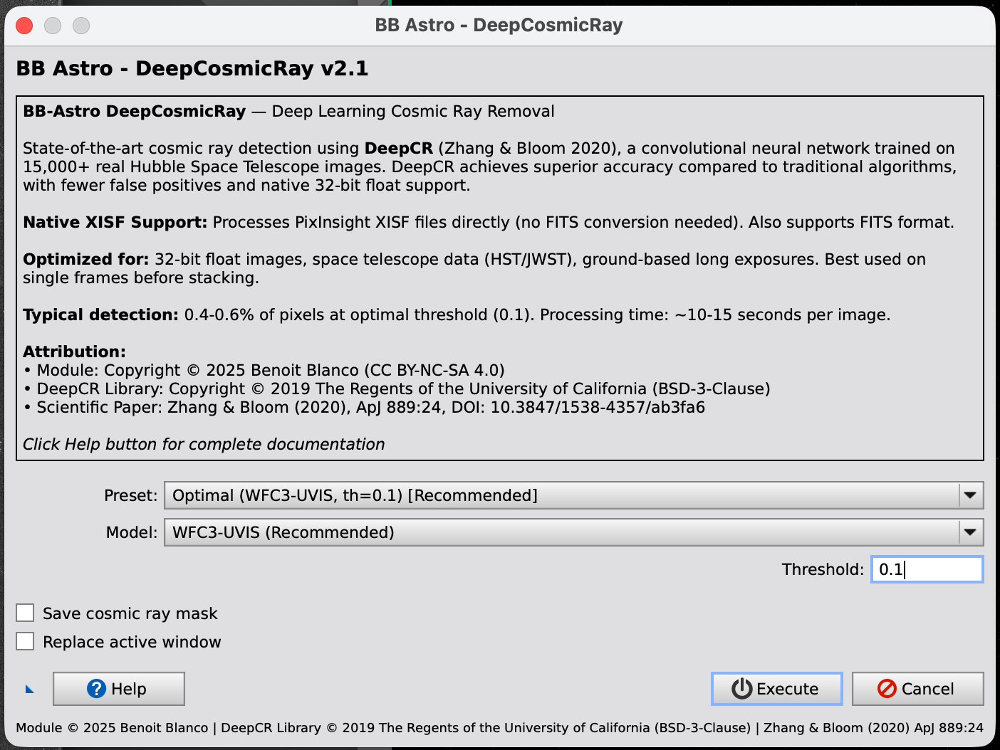

# BB-Astro DeepCosmicRay

**Deep Learning Cosmic Ray Removal for PixInsight**

[](https://github.com/BB-Astro/Pixinsight_Scripts)
[](LICENSE)
[](https://pixinsight.com)
[](https://www.python.org)

Professional cosmic ray detection and removal using state-of-the-art deep learning ([DeepCR](https://github.com/profjsb/deepCR) by Zhang & Bloom 2020).


*User interface with presets, threshold control, and process icon triangle*


*Arp204 example: Original image showing cosmic rays before processing*


*Arp204 cleaned: Image after DeepCR processing with cosmic rays removed*

---

## What is DeepCR?

DeepCR uses a **convolutional neural network** trained on 15,000+ real Hubble Space Telescope images with hand-labeled cosmic rays. Unlike traditional algorithms (L.A.Cosmic, sigma clipping), DeepCR learns from real data to distinguish:

✅ Real cosmic rays (sharp, isolated events)
✅ Hot pixels and detector artifacts
❌ Stars (preserves them!)
❌ Galaxies and extended sources
❌ Image noise

**Result**: Superior accuracy with fewer false positives, optimized for 32-bit float images.

---

## Features

- 🧠 **Deep Learning**: Trained on 15,000+ HST images
- ⚡ **Native XISF**: Processes PixInsight's native format directly (no FITS conversion!)
- 📐 **Process Icons**: Save configurations for batch processing
- 🎯 **4 Ready Presets**: Optimal, Aggressive, Conservative, ACS-WFC
- 🎨 **Clean Interface**: Simple parameters, comprehensive help
- 🚀 **Fast**: ~10-15 seconds per typical image
- 💾 **Quality Control**: Optional cosmic ray mask generation

---

## Installation

### Requirements

- **PixInsight**: 1.9.4 or later for the current V8 release. The update repository retains DeepCosmicRay 2.1.3 for PixInsight 1.8.0 through 1.9.3.
- **Python**: **3.10 or 3.11**, and both ends are hard limits (see below)
- **OS**: macOS or Linux. The script drives Python through a shell wrapper, so Windows is not supported.
- **RAM**: 4GB minimum, 8GB recommended
- **Disk**: about 850 MB for the virtual environment, almost all of it PyTorch
- **Internet**: only to download the packages. The pretrained weights ship inside the `deepcr` package (about 5 MB), nothing is fetched at runtime.

Package versions: see `requirements.txt`.

#### Why the Python version window is so narrow

- **Floor:** `torch` declares `requires_python >=3.10`.
- **Ceiling:** `deepcr` publishes a source distribution only, never a wheel, and its `setup.py` uses `ast.Str.s`, removed in Python 3.12. On 3.12 and later the build dies with `AttributeError: 'Constant' object has no attribute 's'`.

So `pip3 install deepcr` on a current system Python fails. `install_deepcr.sh` handles this: it looks for a 3.10/3.11 interpreter, and falls back to fetching a standalone CPython 3.11 through [uv](https://docs.astral.sh/uv/) if you have it.

One more trap it works around: **`deepcr` declares no dependencies at all on PyPI**, yet `deepCR/training.py` imports `matplotlib` when the package is imported. Without it, `from deepCR import deepCR` raises `ModuleNotFoundError`.

### Step 1: Install the script

Add the BB-Astro repository in **Resources > Updates > Manage Repositories**:

```
https://bb-astro.github.io/BB-Astro_Repository/
```

Then **Resources > Updates > Check for Updates**, select DeepCosmicRay, apply, and restart PixInsight.

Find the module in: **Script → BB-Astro → DeepCosmicRay**

### Step 2: Set up Python

**Just launch the module.** It checks its environment before opening, and if it is missing it offers to build it: click **Set up now** and watch the progress in the PixInsight Console. You can abort from there. No Terminal involved.

It creates `~/.bb-astro/deepcr_venv`, installs the packages, and verifies that both models the module uses (`ACS-WFC` and `WFC3-UVIS`) load.

If you would rather do it by hand:

```bash
bash /Applications/PixInsight/src/scripts/BB-Astro/install_deepcr.sh
```

On Linux the path is `/opt/PixInsight/src/scripts/BB-Astro/` by default. Add `--yes` to run it without prompting.

If no suitable interpreter is found:

```bash
# macOS
brew install python@3.11
# Debian / Ubuntu
sudo apt install python3.11 python3.11-venv
```

Or point the installer at a specific one:

```bash
BB_ASTRO_PYTHON=/path/to/python3.11 bash .../install_deepcr.sh
```

### Verify Installation

```bash
bash /Applications/PixInsight/src/scripts/BB-Astro/run_deepcr.sh --probe
```

Prints the interpreter that will actually be used, or explains what is missing.

---

## Usage

### Basic Workflow

1. **Open an image** in PixInsight (XISF or FITS, 16-bit or 32-bit)

2. **Run the module**:
   Scripts → BB-Astro → DeepCosmicRay

3. **Choose a preset**:
   - **Optimal** (recommended for most images)
   - Aggressive (maximum CR detection)
   - Conservative (minimal false positives)
   - ACS Default (for HST ACS-WFC data)

4. **Click Execute**

5. **Wait ~10-15 seconds**

6. **New window appears** with cleaned image

**First run** is a few seconds slower because PyTorch has to be imported. The pretrained weights are already on disk, inside the `deepcr` package, so nothing is downloaded.

### Understanding Presets

| Preset | Threshold | Detection Rate | Best For |
|--------|-----------|----------------|----------|
| **Optimal** ⭐ | 0.10 | 0.5-0.6% | Most 32-bit images (recommended) |
| Aggressive | 0.05 | 1.0-1.2% | Heavy CR contamination (check for false positives) |
| Conservative | 0.20 | 0.2-0.3% | Preserving faint sources |
| ACS Default | 0.50 | <0.1% | HST ACS-WFC specific data |

### Advanced: Batch Processing with Process Icons

**Save your configuration**:
1. Configure parameters (Preset, Threshold, Options)
2. Click the **triangle button** (📐) in bottom-left
3. Drag icon to desktop, save as `.xpsm` file

**Use saved configuration**:
- **Double-click icon**: Opens module with saved parameters
- **Drag onto image**: Processes directly without dialog (batch mode!)

**Time saved**: 50-70% when processing multiple images

---

## Parameters Guide

### Model Selection

**WFC3-UVIS** (recommended):
- More sensitive to faint cosmic rays
- Works well on 32-bit float images
- Best for most astrophotography

**ACS-WFC**:
- Alternative model for specific datasets
- More conservative (use threshold 0.5)

### Threshold (0.05 - 0.50)

**Lower values** (0.05-0.10):
- Detect more cosmic rays
- Risk of flagging faint stars
- Use for heavy CR contamination

**Medium values** (0.10-0.20) ⭐:
- Balanced detection
- Recommended for most work
- **Start here!**

**Higher values** (0.20-0.50):
- Conservative, fewer false positives
- May miss faint cosmic rays
- Use when preserving photometry critical

### Options

**Save cosmic ray mask**:
- Creates separate window showing detected CRs (white pixels)
- Useful for quality control
- Check to verify no stars are flagged

**Replace active window**:
- Updates current image instead of creating new window
- Use when you want to modify original

---

## Recommended Settings by Image Type

### 32-bit Float Images (Most Common)
```
Preset: Optimal
Model: WFC3-UVIS
Threshold: 0.1
```
Expected: 0.4-0.6% of pixels detected

### Space Telescope (HST/JWST)
```
Preset: Optimal or ACS Default
Threshold: 0.1-0.2
```

### Ground-Based Long Exposures
```
Preset: Optimal
Threshold: 0.10-0.15
```

### Images with Faint Sources
```
Preset: Conservative
Threshold: 0.2
```

---

## Comparison with L.A.Cosmic

| Feature | L.A.Cosmic | DeepCR (this module) |
|---------|------------|----------------------|
| Method | Edge detection | Deep learning |
| Training | Algorithm-based | 15,000+ HST images |
| Accuracy | ⭐⭐⭐⭐ | ⭐⭐⭐⭐⭐ |
| False positives | Can flag faint stars | Very few |
| 32-bit support | Needs rescaling | Native optimized |
| Parameters | 8+ complex params | 2 simple params |
| Speed | ~5-10 sec | ~10-15 sec |

**Recommendation**: Use DeepCR for best quality, especially on 32-bit images.

---

## Troubleshooting

### "The Python environment for DeepCR is not set up yet"

Click **Set up now** in the dialog. If you dismissed it, relaunch the module, or run the setup by hand:

```bash
bash /Applications/PixInsight/src/scripts/BB-Astro/install_deepcr.sh
```

Then restart PixInsight. To see which interpreter the module would use:

```bash
bash /Applications/PixInsight/src/scripts/BB-Astro/run_deepcr.sh --probe
```

It prints the first candidate that actually has `deepCR`, `torch` and `xisf`, searching `~/.bb-astro/deepcr_venv` first, then the system interpreters. Setting `PYTHON_EXECUTABLE` overrides the search entirely.

### `deepcr` fails to build: "'Constant' object has no attribute 's'"

Your Python is 3.12 or newer. `deepcr`'s `setup.py` uses `ast.Str.s`, which was removed in 3.12, and there is no wheel to fall back on. Install Python 3.11 and run the setup script again.

### `pip` refuses with "externally-managed-environment"

Expected. Your Python is protected by PEP 668. Use `install_deepcr.sh`, which installs into its own virtual environment.

### `ModuleNotFoundError: No module named 'matplotlib'`

`deepcr` declares no dependencies on PyPI but imports matplotlib at package import time. `install_deepcr.sh` installs it; a hand-rolled `pip install deepcr torch xisf` does not.

### "Wrapper script not found"

The installation is incomplete. Reinstall DeepCosmicRay from **Resources > Updates** in PixInsight. `BB_DeepCosmicRay.js`, `deepcr_cli.py` and `run_deepcr.sh` must all sit in the same directory, which the package guarantees.

### Too many stars flagged
Increase threshold (try 0.15 or 0.2) or use Conservative preset.

### Missing cosmic rays
Decrease threshold (try 0.05 or 0.08) or use Aggressive preset.

---

## Technical Details

### How It Works

1. **Export**: Active PixInsight image exported to temporary XISF file
2. **Process**: Python script loads image and runs DeepCR neural network
3. **Detect**: Network predicts cosmic ray probability for each pixel
4. **Threshold**: Pixels above threshold flagged as cosmic rays
5. **Inpaint**: Detected pixels replaced using neighbor interpolation
6. **Import**: Cleaned image loaded back into PixInsight
7. **Cleanup**: Temporary files removed automatically

### Supported Formats

- **XISF** (native PixInsight format) - recommended
- **FITS** (16-bit or 32-bit) - compatible

### Performance

| Image Size | Processing Time |
|------------|-----------------|
| 2MP (1500×1500) | ~3 seconds |
| 6MP (2500×2500) | ~6 seconds |
| 15MP (4000×4000) | ~15 seconds |
| 30MP (5500×5500) | ~30 seconds |

**Typical detection**: 0.4-0.6% of pixels at optimal threshold (0.1)

---

## When to Use

### ✅ Recommended For:
- Single light frames before stacking
- 32-bit float images
- Space telescope data (HST, JWST)
- Ground-based long exposures
- Images with visible cosmic rays

### ❌ Not Recommended For:
- Already stacked images (CRs averaged out)
- Very short exposures (<5 seconds)
- Planetary/lunar imaging

### Workflow Position:
Apply **after calibration** (darks/flats/bias) and **before stacking**.

---

## Examples

### User Interface


The interface shows:
- **Preset selector**: Choose from 4 ready-to-use configurations
- **Model selection**: WFC3-UVIS (recommended) or ACS-WFC
- **Threshold control**: Adjustable detection sensitivity (0.05-0.50)
- **Options**: Save cosmic ray mask, Replace active window
- **Triangle button** (📐): Create process icons for batch processing
- **Help button**: In-app documentation

### Results Example: Arp204


*Original image with cosmic rays*


*Cleaned image after DeepCR processing*

This example shows:
- **Effective cosmic ray removal** while preserving galaxy structure
- **Preset used**: Optimal (WFC3-UVIS, threshold 0.1)
- Processing demonstrates the quality of deep learning detection

### Example 1: Single Image Processing
```
1. Open your image (e.g., Arp204.xisf) in PixInsight
2. Scripts → BB-Astro → DeepCosmicRay
3. Select "Optimal" preset
4. Click Execute
5. Wait ~10 seconds
6. Result: Cosmic rays removed
   - Original image preserved
   - New window "Arp204_DeepCR" created
   - Stars and galaxies untouched
```

### Example 2: Batch Processing 20 Images
```
1. Configure module with Optimal preset
2. Click triangle (📐) button in bottom-left
3. Save icon as "DeepCR_Optimal.xpsm"
4. For each of your 20 images:
   - Open image in PixInsight
   - Drag saved icon onto the image
   - Processing runs automatically (no dialog!)
   - Result window appears after ~10-15 seconds
5. Total time: ~5-10 minutes
   vs. ~40 minutes configuring manually each time
```

**Time saved with process icons**: 50-70% for batch processing!

---

## Citation

If you use this module in your research or published astrophotography, please cite:

### DeepCR Paper (required):
```
Zhang, K., & Bloom, J. S. (2020).
Identifying Cosmic Rays in Astronomical Images Using Deep Learning.
The Astrophysical Journal, 889(1), 24.
DOI: 10.3847/1538-4357/ab3fa6
```

### This Module (optional):
```
Blanco, B. (2026).
BB-Astro DeepCosmicRay: PixInsight Module for Deep Learning Cosmic Ray Removal.
https://github.com/BB-Astro/Pixinsight_Scripts
```

BibTeX available in [CITATION.cff](CITATION.cff)

---

## License

### Module Wrapper
**Creative Commons Attribution-NonCommercial-ShareAlike 4.0 International**
Copyright © 2025 Benoit Blanco

You are free to:
- ✅ **Share**: Copy and redistribute
- ✅ **Adapt**: Modify and build upon

Under these terms:
- 📝 **Attribution**: Credit Benoit Blanco
- 🚫 **NonCommercial**: No commercial use without permission
- 🔄 **ShareAlike**: Distribute modifications under same license

### DeepCR Library
**BSD-3-Clause License**
Copyright © 2019 The Regents of the University of California

See [LICENSE](LICENSE) for complete terms.

---

## Contributing

Contributions welcome! Please:
- Open issues for bugs or feature requests
- Submit pull requests for improvements
- Follow existing code style
- Test thoroughly in PixInsight

By contributing, you agree contributions will be under CC BY-NC-SA 4.0.

See [CONTRIBUTING.md](CONTRIBUTING.md) for details.

---

## Support

- **Issues**: [GitHub Issues](https://github.com/BB-Astro/Pixinsight_Scripts/issues)
- **Website**: [www.bb-astro.com](https://www.bb-astro.com)
- **Email**: contact@bb-astro.com

---

## Acknowledgments

- **DeepCR**: Zhang & Bloom ([GitHub](https://github.com/profjsb/deepCR), [Paper](https://arxiv.org/abs/2001.01863))
- **PixInsight**: Professional image processing platform
- **Community**: Testers and contributors

---

## Technical Info

- **Algorithm**: Convolutional Neural Network (U-Net architecture)
- **Training Data**: 15,000+ labeled HST images
- **Models**: WFC3-UVIS and ACS-WFC
- **Processing**: Segmented 512×512 patches for large images
- **Dependencies**: DeepCR, PyTorch, Astropy, xisf

Full technical details in source code comments.

---

**Author**: Benoit Blanco (BB-Astro)
**Version**: 2.2.1
**Release**: July 2026
**Website**: [www.bb-astro.com](https://www.bb-astro.com)
**License**: CC BY-NC-SA 4.0 (non-commercial)
