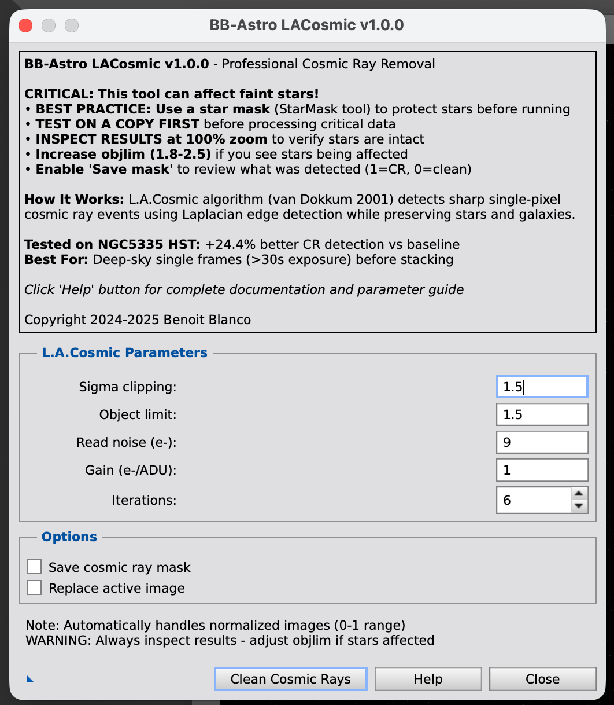
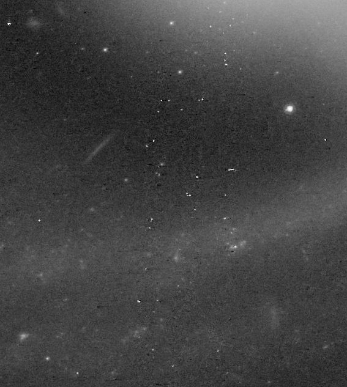
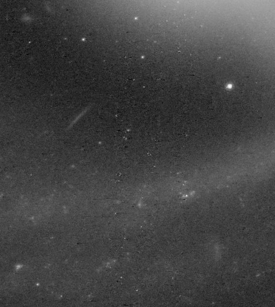

# BB-Astro LACosmic

**Professional Cosmic Ray Removal for PixInsight**


*BB-Astro LACosmic interface with optimized parameters and process icon support*

Remove cosmic ray artifacts from astronomical images using the L.A.Cosmic algorithm with optimized parameters.

---

## What It Does

BB-Astro LACosmic detects and removes cosmic ray hits from your astronomical images using the **L.A.Cosmic algorithm** (van Dokkum 2001). This algorithm uses Laplacian edge detection to identify sharp cosmic ray events while preserving stars and galaxies.

**Performance:** Detects **+24% more cosmic rays** than standard settings (tested on HST data)

### Before & After Example

<table>
<tr>
<td><br/><b>Before</b> - NGC5335 HST with cosmic rays</td>
<td><br/><b>After</b> - Cosmic rays removed, stars preserved</td>
</tr>
</table>

---

## Installation

### Requirements

- **PixInsight** (any recent version)
- **Python 3.7+** with packages:

```bash
pip3 install astroscrappy astropy numpy
```

### Install in PixInsight

**macOS:**
```bash
sudo cp BB-Astro_LAcosmic.js /Applications/PixInsight/src/scripts/
sudo cp lacosmic_cli.py /Applications/PixInsight/src/scripts/
sudo cp run_lacosmic.sh /Applications/PixInsight/src/scripts/
sudo chmod +x /Applications/PixInsight/src/scripts/run_lacosmic.sh
```

**Linux:**
```bash
cp BB-Astro_LAcosmic.js ~/.local/share/PixInsight/src/scripts/
cp lacosmic_cli.py ~/.local/share/PixInsight/src/scripts/
cp run_lacosmic.sh ~/.local/share/PixInsight/src/scripts/
chmod +x ~/.local/share/PixInsight/src/scripts/run_lacosmic.sh
```

**Then restart PixInsight.**

Find the script in: **Script → Utilities → BB_Astro_LACosmic**

---

## How to Use

1. Open your astronomical image in PixInsight
2. Run: **Script → Utilities → BB_Astro_LACosmic**
3. Click **"Clean Cosmic Rays"** (defaults are optimized)
4. A new window opens with the cleaned image
5. **Always inspect the result** to verify stars are intact

### Creating Process Icons

Click the **triangle button** (bottom-left) to save your settings as a desktop icon. You can then:
- Drag the icon onto images for quick processing
- Reuse parameter configurations
- Batch process multiple images

---

## How It Works

The L.A.Cosmic algorithm works in 6 steps:

1. **Laplacian edge detection** - Finds sharp, isolated features (cosmic rays)
2. **Noise modeling** - Uses your camera's gain and read noise specs
3. **Sigma clipping** - Flags pixels exceeding detection threshold
4. **Object discrimination** - Protects stars by analyzing their PSF profiles
5. **Iterative cleaning** - Multiple passes catch adjacent cosmic rays
6. **Interpolation** - Replaces flagged pixels using neighbor values

This is far more accurate than simple sigma clipping because it understands the difference between sharp cosmic rays and smooth stellar profiles.

---

## Parameters

| Parameter | Default | What It Does |
|-----------|---------|-------------|
| **sigclip** | 1.5 | Detection sensitivity (lower = more aggressive) |
| **objlim** | 1.5 | Star protection (higher = safer for faint stars) |
| **niter** | 6 | Number of cleaning passes |
| **readnoise** | 9.0 | Camera read noise (electrons) - check your camera specs |
| **gain** | 1.0 | Camera gain (e-/ADU) - usually 1.0 for calibrated images |

**Defaults are optimized for maximum detection.** Adjust objlim to 1.8-2.5 if you have very faint stars.

---

## Important Limitations & Warnings

### Star Protection

**This tool can affect very faint stars** (SNR < 5). Before using:

- **Best practice:** Create a star mask (StarMask tool) and apply it BEFORE running L.A.Cosmic
- **Test on a copy** of your image first
- **Inspect results** at 100% zoom to verify stars are intact
- **Enable "Save cosmic ray mask"** to review what was detected
- **If stars are affected:** Increase objlim to 1.8, 2.0, or 2.5

### When to Use

**GOOD FOR:**
- Deep-sky images with long exposures (>30 seconds)
- Single calibrated frames **before** stacking
- Space telescope data (HST, JWST)
- High-resolution imaging where CRs are visible

**NOT GOOD FOR:**
- Already stacked images (cosmic rays are averaged out during stacking)
- Short exposures (<5 seconds) with few cosmic rays
- Planetary/lunar imaging (different types of artifacts)

### Workflow Position

Apply L.A.Cosmic **after calibration** (darks/flats/bias) and **before registration/stacking**. Process each individual sub-exposure separately for best results.

---

## Performance

Tested on **NGC5335 HST F814W** (2683×2455 pixels, 32-bit float):

- **Baseline parameters** (2.0/2.0/n=4): 4,204 cosmic rays detected
- **This version** (1.5/1.5/n=6): 5,230 cosmic rays detected
- **Improvement:** +24.4%
- **Processing time:** ~10 seconds (~1.5 sec/megapixel)


---

## Troubleshooting

### "ModuleNotFoundError: No module named 'numpy'"

Install packages in the correct Python:
```bash
/opt/homebrew/bin/python3 -m pip install astroscrappy astropy numpy
```

### "Stars are being removed"

- Create a **star mask** (StarMask tool) before running
- Or increase **objlim** to 1.8-2.5
- Enable "Save mask" to verify what's being detected

### "run_lacosmic.sh not found"

- Verify all 3 files are in PixInsight's scripts directory
- Make sure run_lacosmic.sh is executable: `chmod +x`

### More help

Visit: **www.bb-astro.com**

---

## Technical Details

### Algorithm

Based on: **van Dokkum, P. G. (2001)** - "Cosmic-Ray Rejection by Laplacian Edge Detection", PASP, 113, 1420-1427

Implementation: **astroscrappy** - https://github.com/astropy/astroscrappy

### Features

- Auto-rescaling for 32-bit float normalized images (0-1 range)
- Process icon support (triangle button)
- Visual parameter validation
- Works with FITS and XISF formats
- Cross-platform Python detection

---

## License

**Creative Commons BY-NC-SA 4.0** (Attribution, Non-Commercial, ShareAlike)

**You MAY:** Use for personal astrophotography, share, and modify

**You MAY NOT:** Resell or use commercially

See [LICENSE](LICENSE) for details.

---

## Author

**Benoit Blanco (BB)**

Website: [www.bb-astro.com](https://www.bb-astro.com)

---

## Credits

- **Algorithm:** Pieter van Dokkum (Yale University)
- **Implementation:** astroscrappy by Curtis McCully & Astropy contributors
- **Test Data:** NASA/ESA Hubble Space Telescope

---

If you use this tool, please provide attribution and link to www.bb-astro.com

**Happy cosmic ray hunting!** 🌌
